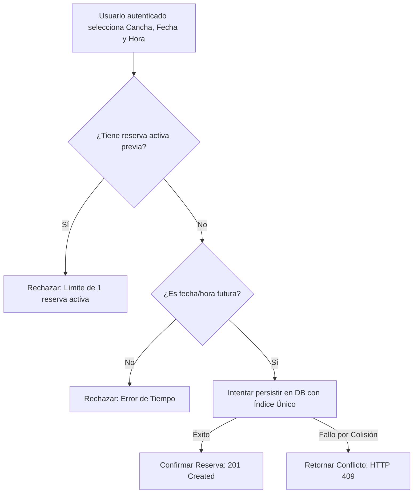

# Spec: Módulo de Creación y Gestión de Reservas
> **Estado:** Draft | **Última actualización:** 2026-09-30
> **Ubicación de Arquitectura:** Bounded Context / Módulo de Reservas y Gestión

---

## 1. Contexto y Delimitación del Dominio

### 1.1 Visión General

Permitir a los usuarios autenticados explorar la disponibilidad y gestionar reservas de turnos de 1 hora en un catálogo cerrado de 5 canchas de pádel, garantizando la integridad de la agenda, la prevención estricta de colisiones (*double-booking*) a nivel de persistencia y el control de una única reserva activa por usuario.

### 1.2 Objetivos (Goals) vs. No-Objetivos (Non-Goals)

* **In-Scope:**
* Autenticación básica de usuarios.
* Exploración de grilla de 24 horas (bloques de 1 hora) para las 5 canchas fijas.
* Creación atómica de reservas con prevención de condiciones de carrera.
* Panel de gestión de reservas propias (visualización y cancelación de turnos futuros).
* Restricción de una sola reserva activa por usuario de forma simultánea.


* **Out-of-Scope:**
* Pasarela de pagos integrada (pago presencial en sede).
* Panel de administración web para modificar canchas (catálogo inmutable en código).
* Notificaciones externas (SMS, WhatsApp o correos electrónicos).
* Reservas continuas de más de 1 hora en un solo clic o sistemas de matchmaking.


### 1.3 Lenguaje Ubicuo

| Término | Definición | Ejemplo / Comentario |
| --- | --- | --- |
| **Catálogo Cerrado** | Conjunto inmutable de 5 canchas físicas predefinidas en el sistema. | Cancha Laureles, El Poblado, Belén, Robledo, Envigado. |
| **Bloque Disponible** | Franja horaria de 1 hora libre de asignaciones previas en la grilla. | Slot de 14:00 a 15:00 en Cancha Laureles. |
| **Colisión de Concurrencia** | Intento simultáneo de dos usuarios por reservar el mismo slot al mismo milisegundo. | Resuelto mediante índice único compuesto en base de datos (`409 Conflict`). |
| **Reserva Activa** | Turno futuro confirmado que actualmente detenta el usuario en el sistema. | El usuario solo puede tener una a la vez. |

---

## 2. Especificación Funcional y Reglas de Negocio

### 2.1 Reglas de Negocio

* **[RN-001] Catálogo Inmutable:** El sistema opera estrictamente sobre las 5 canchas definidas en el código (`Cancha Laureles`, `Cancha El Poblado`, `Cancha Belén`, `Cancha Robledo`, `Cancha Envigado`).
* **[RN-002] Restricción Temporal:** El sistema DEBE rechazar cualquier intento de reserva en fechas u horarios pasados respecto al timestamp actual del servidor.
* **[RN-003] Granularidad y Límite:** Las reservas se estructuran estrictamente en bloques enteros de 1 hora. Un usuario no puede acumular más de una (1) reserva activa simultáneamente.
* **[RN-004] Prevención de Colisión:** El sistema validará la disponibilidad en la base de datos de forma atómica. Si ocurre una condición de carrera, se retornará un código HTTP `409`.

### 2.2 Flujo Principal de Creación



```

```